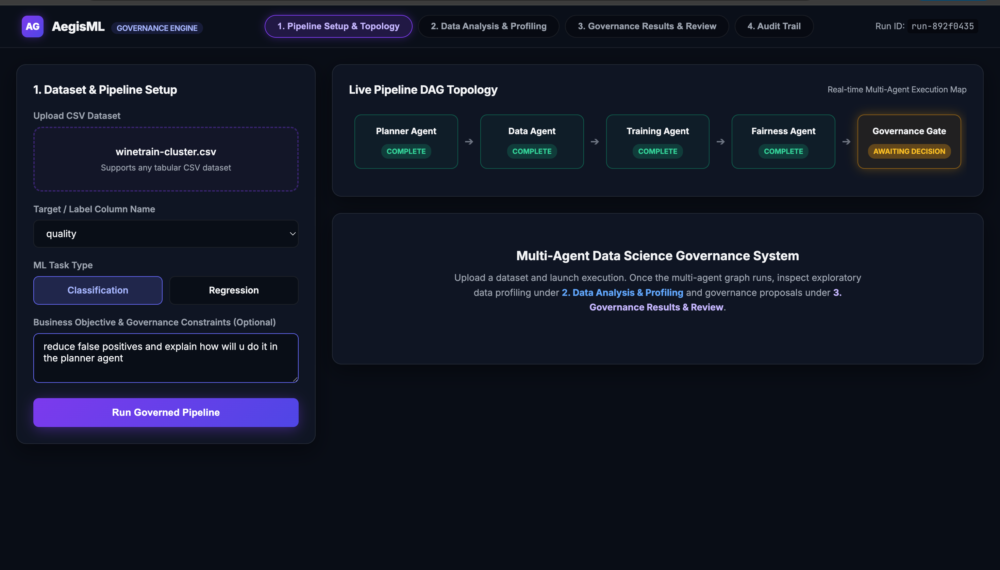
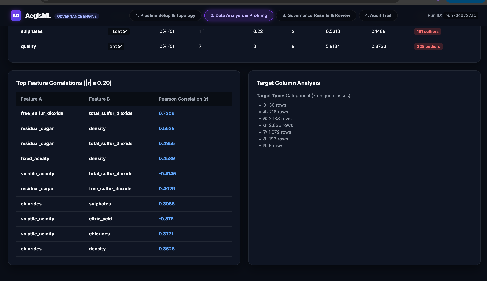
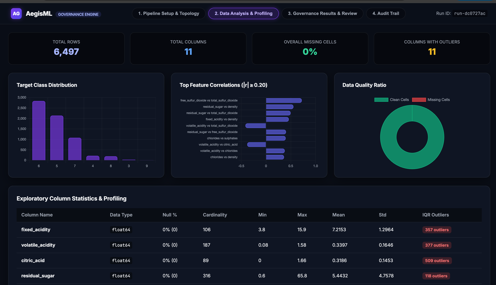
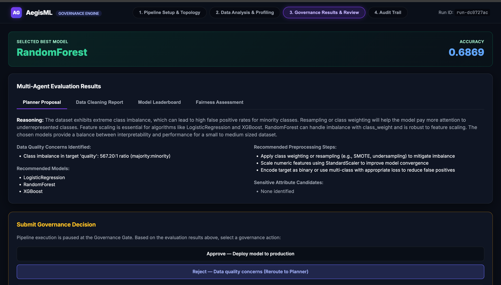
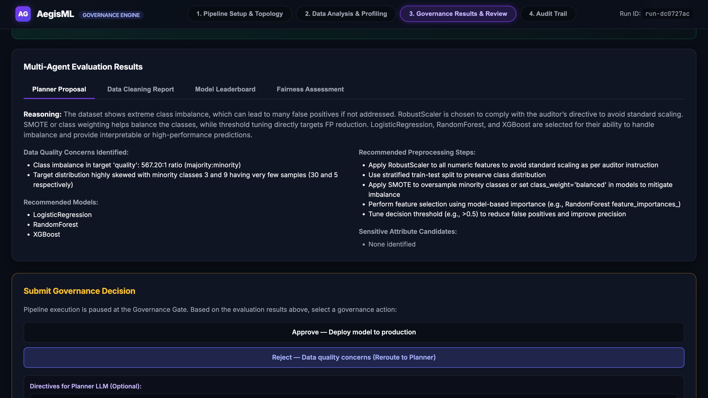
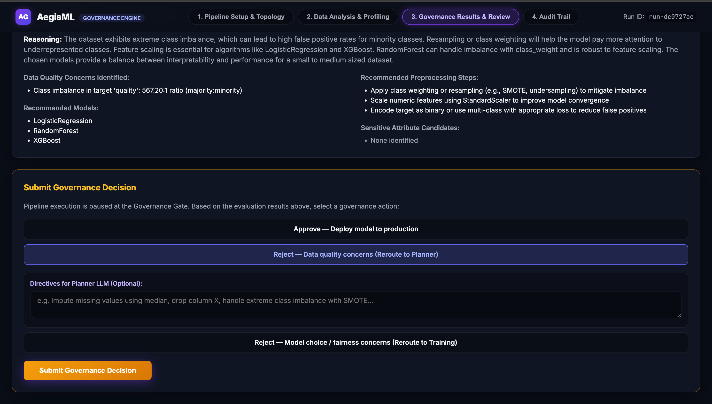
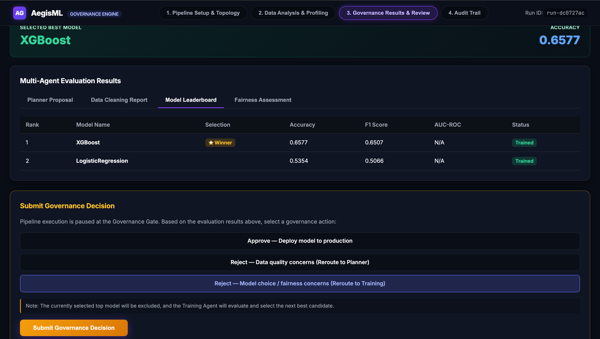
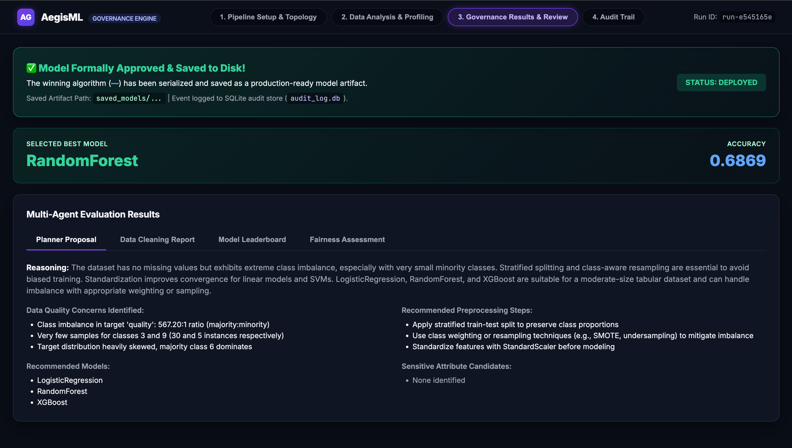
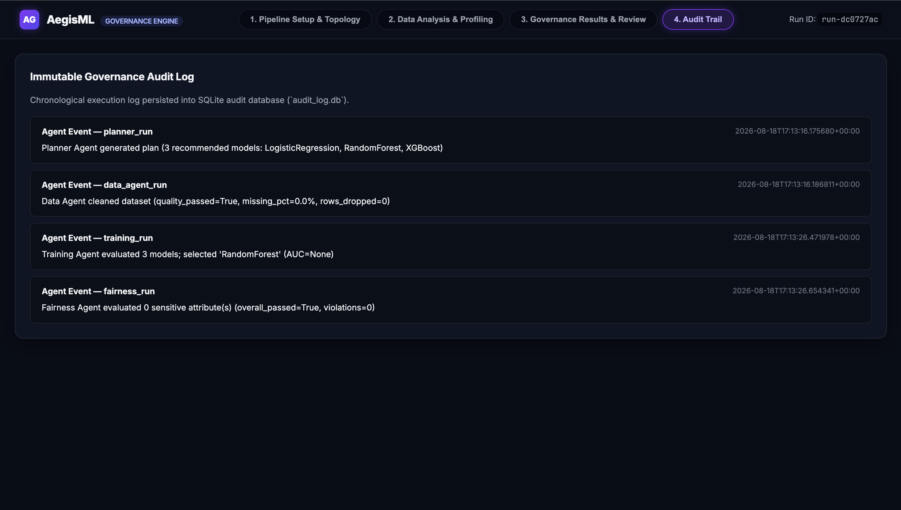

# AegisML: Autonomous Multi-Agent AI Data Science & Governance Platform

[](https://python.org)
[](https://fastapi.tiangolo.com)
[](https://langchain.com)
[](https://groq.com)
[](https://sqlite.org)

**AegisML** is an enterprise-grade, state-checkpointed multi-agent machine learning platform designed to bridge automated AI data science with human governance, algorithmic fairness auditing, and immutable compliance logging.

---

## 🌟 Architecture & Key Highlights

- **6 Specialized Pipeline Nodes**: Seamlessly orchestrates Exploratory Data Analysis, LLM Model Strategy Planning, Deterministic Data Cleaning, Ensemble Model Training & SHAP, Subgroup Fairness Auditing, and Governance Gate Interrupts.
- **State Checkpointing & Resumption**: Built on **LangGraph** with a persistent SQLite checkpointer (`pipeline_state.db`), enabling crash-recovery and zero-latency human-in-the-loop interrupts.
- **Human-in-the-Loop Governance Gates**: Pauses execution before model deployment to present evaluation reports to human auditors with custom prompt directive injection and model candidate exclusion.
- **3-Loop Resilience System**: Features automated quality retry loops and two interactive human reroute loops.
- **Immutable Audit Logger**: Every agent execution event, metric evaluation, and human reviewer decision is recorded sequentially in `audit_log.db`.

---

## 🔄 Multi-Agent DAG Topology & Looping Mechanics

### Pipeline Flow Diagram

```text
[START: User CSV Upload + Target Column & Task Selection]
                          │
                          ▼
             [1. Data Analysis Agent]
   (EDA profiling, IQR outliers, Pearson correlations, Chart.js)
                          │
                          ▼
               [2. Planner Agent]  <───────────────────────────┐
     (Groq LLM generates JSON plan & strategy)               │
                          │                                     │ [LOOP 1: Auto Quality Retry]
                          ▼                                     │ (Data Agent Quality Fail)
                [3. Data Agent] ────────────────────────────────┘
   (Imputation, frequency encoding, feature scaling)
                          │
                          ▼
              [4. Training Agent]  <───────────────────────────┐
   (RandomForest, XGBoost, LabelEncoder, SHAP)                  │
                          │                                     │ [LOOP 3: Human Model Exclusion]
                          ▼                                     │ (reject_model_or_fairness)
              [5. Fairness Agent]                               │
   (Disparate Impact >= 0.80 & Parity Diff <= 0.10)             │
                          │                                     │
                          ▼                                     │
            [6. Governance Gate Node] ──────────────────────────┤
     (Pauses execution via LangGraph interrupt)                 │
              │                       │                         │
              │                       │ [LOOP 2: Human Directives]
              │ Approve               └─────────────────────────┘
              ▼                       (reject_data_quality + human_feedback)
     [END: Approved Deployment]
   (Logs state & saves model artifact to disk)
```

### 6 Pipeline Agent Nodes

1. **`Data Analysis Agent` (`data_analysis_agent.py`)**: Performs initial exploratory data profiling, computing missingness ratios, column summary statistics, IQR outliers, Pearson correlation matrices ($|r| \ge 0.20$), target distributions, and interactive Chart.js visualization payloads.
2. **`Planner Agent` (`planner_agent.py`)**: Uses Groq LLM (`llama-3.3-70b-versatile`) with prompt schema truncation guardrails (< 1,800 tokens) to analyze schema metadata, identify data quality concerns, and output a structured JSON plan.
3. **`Data Agent` (`data_agent.py`)**: Executes deterministic data cleaning, missing value imputation (median/mode/mean), frequency encoding, and feature scaling.
4. **`Training Agent` (`training_agent.py`)**: Converts target `y` using `LabelEncoder` (0..N-1) for 100% XGBoost compatibility across binary and multi-class tasks. Fits ensemble models (`RandomForest`, `XGBoost`, `LogisticRegression`/`Ridge`), ranks leaderboards, and extracts top-5 SHAP feature importances.
5. **`Fairness Agent` (`fairness_agent.py`)**: Evaluates subgroup equity across demographic candidates (gender, race, age) enforcing Disparate Impact ($\ge 0.80$) and Demographic Parity Difference ($\le 0.10$).
6. **`Governance Gate Node` (`pipeline_graph.py`)**: Calls `interrupt(payload)`, pausing graph execution to present evaluation reports to human auditors on the web dashboard.

### 3-Loop Resilience System

- **Loop 1: Automated Data Quality Retry Loop**: If `Data Agent` detects `quality_check_passed == False` (e.g. unhandled missing values $>5\%$), it automatically loops back to `Planner Agent` (max 2x) passing `last_failure_reason`.
- **Loop 2: Human Data Directives Loop**: If a human reviewer selects **Reject (Data Quality)** with optional custom text directives (`human_feedback`), execution reroutes to `Planner Agent`, injecting instructions into the Groq LLM system prompt.
- **Loop 3: Human Model Exclusion Loop**: If a human reviewer selects **Reject (Model Choice / Fairness)**, the currently winning model is added to `rejected_models`, and execution reroutes to `Training Agent` to train and select the next best algorithm.

---

## 🖼️ Visual Feature Walkthrough

### 1. Dataset Upload & Pipeline Setup
Upload any tabular CSV dataset, select target column (with auto-detected classification or regression task type), and view real-time DAG node execution status.



---

### 2. Exploratory Data Profiling
Dedicated **Data Analysis & Profiling** dashboard page displaying summary KPI banners, column data types, null counts, cardinality, range, mean, std, and IQR outlier detection.



---

### 3. Interactive Data Analysis Visualizations (Chart.js)
Real-time visual chart panels rendering target class/value distribution histograms, top feature correlation strength bars, and data quality ratios.



---

### 4. LLM Model Strategy & Proposal
Groq LLM-generated plan displaying data quality concerns, recommended preprocessing steps, model algorithms, and sensitive attribute candidates.





---

### 5. Governance Gate & Human-in-the-Loop Decision Panel
Paused pipeline execution checkpoint giving human auditors 3 governance decision paths: **Approve**, **Reject Data Quality** (with custom text prompt directives), or **Reject Model Choice** (with candidate exclusion).



---

### 6. Resumed Execution & Pipeline State Progress
Real-time topology status updating as the graph resumes execution following a governance decision.



---

### 7. Approved Model Deployment & Disk Serialization
Formally approves winning model, saves serialized `.joblib` model artifact to `saved_models/`, and displays deployment status banner.



---

### 8. Immutable Governance Audit Trail
Chronological event audit log persisted into SQLite (`audit_log.db`), recording agent events, metrics, human reviewer decisions, and feedback text.



---

### 9. System Pipeline Architecture Flow Reference


---

## 🚀 Quickstart & Local Installation

### Prerequisites

- Python 3.9+ installed
- Groq API Key ([Get Groq Key](https://console.groq.com))

### 1. Clone & Setup Environment

```bash
git clone https://github.com/ruhannpn/AegisML.git
cd AegisML

# Create virtual environment
python3 -m venv .venv
source .venv/bin/activate

# Install dependencies
pip install -r requirements.txt
```

### 2. Configure Environment Variables

Create a `.env` file in the root directory:

```env
GROQ_API_KEY=your_groq_api_key_here
```

### 3. Run Web Application

```bash
python server.py
```

Open your browser and navigate to:
```text
http://localhost:8000
```

---

## 📁 Repository Structure

```text
├── server.py                   # FastAPI REST application & endpoint handlers
├── pipeline_graph.py           # LangGraph stateful DAG orchestration & interrupt logic
├── graph_state.py              # PipelineState TypedDict & DataFrame serialization helpers
├── data_analysis_agent.py      # Exploratory Data Analysis profiler & Chart.js generator
├── planner_agent.py            # Groq LLM metadata reasoning agent & prompt compression
├── data_agent.py               # Deterministic data cleaning, imputation & scaling agent
├── training_agent.py           # LabelEncoding, ensemble training, leaderboard & SHAP agent
├── fairness_agent.py           # Demographic subgroup equity auditing agent
├── audit_log.py                # Immutable SQLite audit logger (audit_log.db)
├── static/
│   └── index.html              # Dark slate glassmorphism web UI with Chart.js
├── images/                     # Screenshot documentation assets
└── saved_models/               # Serialized joblib production model artifacts
```

---

## 📜 License & Compliance

Developed for **Academic Review 2 Evaluation**. Built in compliance with EU AI Act, Fair Credit Reporting Act, and corporate audit standards.
